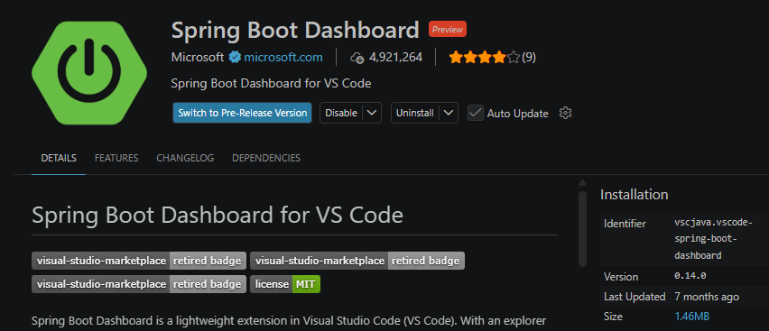

# I. Start Application

Download **Extensions: MarketPlace** to help you run the Spring Boot server

```bash
Spring Boot Dashboard
```



# II. Access Backend URL

Local access to the Swagger UI URL:
```bash
http://localhost:80/api/v1/swagger-ui/index.html

# OR

http://localhost:8080/api/v1/swagger-ui/index.html

```

To OpenAPI JSON spec
```bash
http://localhost:80/api/v1/v3/api-docs

# OR

http://localhost:8080/api/v1/v3/api-docs
```